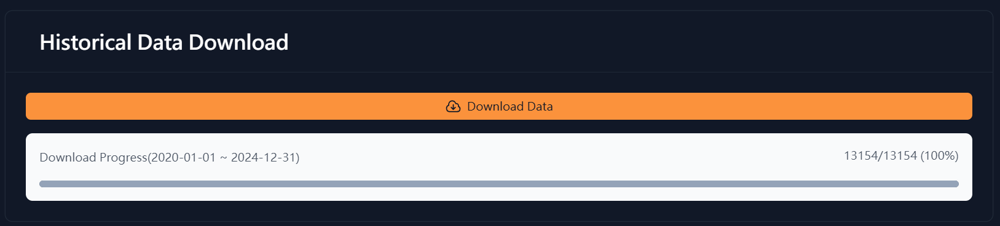
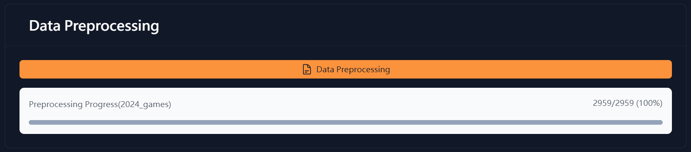
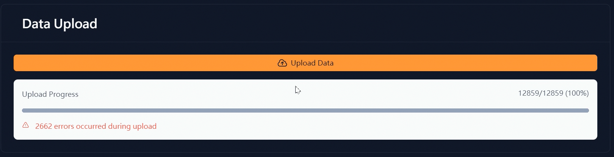
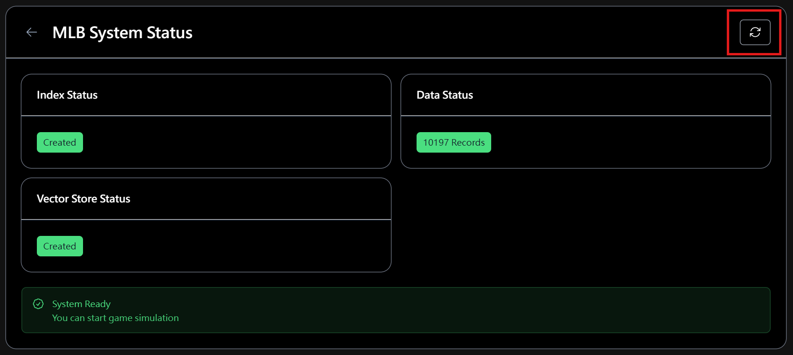

# MLB Game Simulator

**MLB Game Simulator** utilizes **Google Gemini AI** technology combined with **MLB historical data** to generate more realistic simulation results. You can freely set up matchups, adjust tactical strategies, and even specify starting lineups - then just hit the simulate button!

[](https://www.youtube.com/watch?v=MInEtGRfmzk)
* [Play Ground](https://mlbgame.raccoonhands.cloud/)

## ✨ Project Highlights

* **Real Data:** Based on actual MLB historical data.
* **AI-Powered:** Enhanced by Google Gemini AI engine, delivering the most intelligent and unpredictable game results.
* **Intuitive Interface:** Clean and intuitive interface with dynamic baseball field animations and real-time scoring.
* **Data Processing:** Complete data processing pipeline from data acquisition to preprocessing and uploading to the efficient Pinecone vector database.

## 🏗️ Project Architecture

* **Frontend:** Built with Vue.js, Nuxt.js, and Tailwind CSS.
* **Backend API:** Powered by Nuxt.js, integrated with Google Gemini AI and Pinecone for data and simulation logic.
* **Data Processing Service:** Fetches data from MLB official API, preprocesses it, and uploads to Pinecone.

## 🚀 Deployment Guide:

Deploy your own MLB Game Simulator with ease!

### 1. Prerequisites:

* Ensure [Node.js](https://nodejs.org/) is installed (version 18 or above recommended).
* Obtain a [Pinecone](https://www.pinecone.io/) account (no need to create an Index - it will be generated automatically).
* Obtain a [Google AI Studio](https://aistudio.google.com/) account and generate an API Key.

### 2. Configure Environment Variables:

Create a `.env` file in the project root and add the following:

```
GOOGLE_API_KEY=Your Google Gemini API Key
PINECONE_API_KEY=Your Pinecone API Key
PINECONE_INDEX_NAME="mlb-games"
```

### 3. Launch the Application:

```bash
# Install dependencies
npm install

# Start development server
npm run dev
```

Then, open your browser and visit `http://localhost:3000`.

### 4. Data Processing:

Navigate to `http://localhost:3000/config` and follow these steps:

* **Historical Data Download:** Click the Download Data button and wait for completion.


* **Data Preprocessing:** Click the Preprocess Data button and wait for completion.


* **Data Upload:** Click the Upload Data button to upload data to Pinecone and wait for completion.


* **Refresh System Status:** Click the Refresh button. Congratulations! You can now start simulating games.
